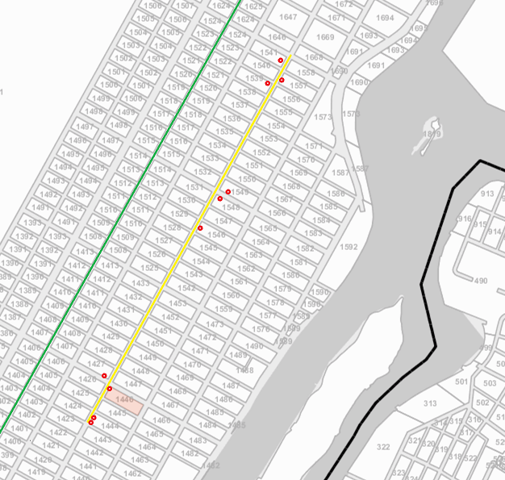

```{r setup, include=FALSE}
knitr::opts_chunk$set(warning = FALSE,
                      message = FALSE, 
                      cache = TRUE)
```

## Analysis of Buliding Permits

Does the new subway line Q affect the construction of buildings in the relevant Upper East Side neighborhoods? To understand how its impact may be, we first performed the analysis on the Building Permits data, looking into both new buildings and remodeling constructions. 
    
### Analysis of Building Permits for Phase 1

On this data set, we focused on phase 1 – the Q line (short for Q line below) and phase 2 of Second Avenue Subway line (short for phase 2 below), since phase 3 and phase 4 have no committed funding yet. We also focused on the quantity of building permits filed because other categorical factors such as if a building is residential, commercial is not available. 

Intuitively, we anticipate different levels of impacts according to how far the block is away from the Q line. We added a new column “Distance”, and recorded the approximate distance in blocks from each building filing a building permit, to the Q line.

We then combined the “Distance” column and the Official Tax Map of New York City, which graphically shows the block number and street names in the map. The link to access the online Digital Tax Map is here: http://gis.nyc.gov/taxmap/map.html

In this map, we are able to highlight the pre-existing Lexington Avenue Line (in green), the Q line (in yellow), and the stations entrances. This helps us to visually determine a few important measurements: 1) the blocks that are near the Q Line, 2) their distance to the Q Line, and 3) the distance from this block to an station entrance.



<br><br>

Would the impact vary if the block were on the east, or west side of the Q line? We suspected it would, because for the blocks on the east side of the Q line, there was no subway access at all, while it was fairly easy to access the pre-existing Lexington Avenue line from the blocks on the west side of Q. Therefore, we differentiated our blocks by "East" and "West" of the Q line. 

<br>

The first preparation we did for the analysis was to convert the Dates column from Factor to Date format and Distance column from Factor to numeric:


```{r}
library(tidyverse)
permits_upper_east <- read.csv("data/DOB_Permit_Issuance.csv")
permits_upper_east$Filing.Date = as.Date(permits_upper_east$Filing.Date, format = "%m/%d/%Y")
permits_upper_east$Issuance.Date = as.Date(permits_upper_east$Issuance.Date, format = "%m/%d/%Y")
permits_upper_east$Job.Start.Date = as.Date(permits_upper_east$Job.Start.Date, format = "%m/%d/%Y")
permits_upper_east$Block = as.numeric(permits_upper_east$Block)
```

####Buildings on the left side of the 2nd Ave Line - Phase 1

For blocks on the west of the Q Line, we put them into three categories:

1) block id that are within 1 block on the west;
2) block id that are within 2-3 blocks on the west; and
3) block id that are within 4-5 blocks on the west; from the Q Line


```{r}
data_phase1 <- permits_upper_east %>%
  mutate(Distance = ifelse(Block %in% c(1424:1427, 1529:1532,1539:1541,1423,1428:1433,
                                        1525:1528,1533:1538,1646),
                                 '1 block left from 2nd Ave Line',
                          ifelse(Block %in% c(1404:1407,1512:1515,1522:1524,1403,1408:1413,
                                              1508:1511,1516:1521,1624),
                                 '2-3 blocks left from 2nd Ave Line',
                          ifelse(Block %in% c(1384:1387,1495:1498,1505:1507,1383,1388:1393,
                                              1491:1494,1499:1504,1602),
                                 '4-5 blocks left from 2nd Ave Line',
                                 'other'))))
```


Now we can visualize and compare the variation of new and remodeling building permits over time, among the three different categories noted above.

We first summarized by "Filing.Date", "Filing.year"" and "Distance"", then scaled the data and created an index to visualize variations over time with time series lines for years from 2001 to 2017:


```{r fig.height=7, fig.width=14}
#First, summarize by Filing.Date year and Distance:
library(lubridate) #dates library
data_phase1 <- data_phase1 %>%
  group_by(Filing.Year = year(Filing.Date), Distance) %>%
  summarise(Total = n()) %>%
  arrange(Filing.Year) #arranges from lowest to highest value

#Now, scale the data and create an index to visualize variations over time, then plot:
data_phase1 <- data_phase1 %>% group_by(Distance) %>%
  filter(Filing.Year >= 2001 & Filing.Year <= 2017) %>%
  filter(Distance != "other") %>%
  mutate(index = 100*Total/Total[1]) %>% ungroup()

#Plot time series:
library(ggthemes)
ggplot(data_phase1, aes(Filing.Year, index, color = Distance)) + geom_line(lwd = 1) +
    ggtitle("Building Permits Vs Distance to 2nd Ave (Phase1-left)") +
    labs (x = "Year", y = "Indexed Variation in Building Permits") +
    theme_grey(16) +
    theme(legend.title = element_blank()) +
    scale_colour_colorblind()
```
<br>

**Conclusion:** From the graph above, it is clear that the number of building permits filed is related to the distance a block is from the Q line. For blocks located on the west side of the subway line, the closer they are to the Q line, the higher the increase is in filing building permits. 
We can also easily spot the declining trend in filing building permits starting 2015 toward 2017 – when Q line was put into full operation. 
This is unsurprising since filing for a permit is the first step of building construction or renovation, we would anticipate the filing peak taking place earlier than the completion of the subway, instead of around the same time or later its completion.

 
<br>

####Buildings on the right side of the 2nd Ave Line - Phase 1

From the map above we can see, there are only 3 blocks between the Q Line and the East River, with an exception of a small group of blocks located four blocks from the line. So we made minor adjustments to categorizing them more properly: 

1) block ids that are within 1 block on the east side;
2) block ids that are within 2 blocks on the east side; and
3) block ids that are within 3-4 blocks on the east side from the Q line.


Using the block ids for each of those 3 categories, we followed the same procedure performed to analyze building permits on the west side.


```{r}
data_phase1 <- permits_upper_east %>%
  mutate(Distance = ifelse(Block %in% c(1444:1447,1546:1549,1556:1558,1443,1448:1453,
                                        1542:1545,1550:1555,1668),
                                 '1 block right from 2nd Ave Line',
                          ifelse(Block %in% c(1464:1467,1563:1566,1573,1463,1468:1473,
                                              1559:1562,1567:1571,1690),
                                 '2 blocks right from line',
                          ifelse(Block %in% c(1482:1484,1580:1583,1480,1485:1490,1576:1579,
                                              1584:1587,1590,1592,1589),
                                 '3-4 blocks right from 2nd Ave Line',
                                 'other'))))
```

Now we can visualize and compare the variation of building permits over time, among the different categories detailed above, by following the same procedure described previously:

```{r fig.height=10, fig.width=17}
#First, summarize by Filing.Date year and Distance:
library(lubridate) #dates library
data_phase1 <- data_phase1 %>%
  group_by(Filing.Year = year(Filing.Date), Distance) %>%
  summarise(Total = n()) %>%
  arrange(Filing.Year) #arranges from lowest to highest value

#Now, scale the data and create an index to visualize variations over time, then plot:
data_phase1 <- data_phase1 %>% group_by(Distance) %>%
  filter(Filing.Year >= 1990 & Filing.Year <= 2017) %>%
  filter(Distance != "other") %>%
  mutate(index = 100*Total/Total[1]) %>% ungroup()

#Plot time series:
library(ggthemes)
ggplot(data_phase1, aes(Filing.Year, index, color = Distance)) + geom_line(lwd = 0.75) +
    ggtitle("Building Permits Vs Distance to 2nd Ave (Phase1-right)") +
    labs (x = "Year", y = "Indexed Variation in Building Permits") +
    theme_grey(16) +
    theme(legend.title = element_blank()) +
    scale_colour_colorblind()
```
<br>

**Preliminary Conclusions:** 

Initially, we had plotted just recent years (similar to what we did for buildings on the west side of the Q line), but we noticed that the category “3-4 blocks east from Q line” had a higher increase in variation than other categories, which was unexpected.

However, after plotting from 1990 – the first year that data was available, we noticed that historically, this group of blocks has always had a higher increase in the number of building permits. One possible explanation was that this group of blocks sits right next to the East River, where the water views and riverside parks make it an ideal residential destination that would attract a higher number of projects.  

To isolate that phenomenon, we could simply remove the category “3-4 blocks east from line”, but then we would need some more visual evidence to see how the Q Line affects the filing of building permits.  ???  need a fresh pair of eyes 

For that purpose, we further divided the category “1 block east from Q Line” into the following 2 categories:

1) buildings located within a one-block radius from a Q Line station entrance 
2) all other buildings, within 1 block east from the Q Line

Similarly, we further differentiated the category “2 blocks east from Q Line” into the following 2 categories:

3) buildings located within 2 block radius from a Q Line station entrance
4) all other buildings, within 2 blocks east from Q Line


Using the block ids for each of the 4 categories detailed above, we followed the same procedure described previously:

```{r}
data_phase1 <- permits_upper_east %>%
  mutate(Distance = ifelse(Block %in% c(1444:1447,1546:1549,1556:1558),
                                  '1 block radius from station entrance (right side)',
                          ifelse(Block %in% c(1443,1448:1453,1542:1545,1550:1555,1668),
                                 'other, 1 block right from 2nd Ave Line',
                          ifelse(Block %in% c(1464:1467,1563:1566,1573),
                                  '2 block radius from station entrance (right side)',
                          ifelse(Block %in% c(1463,1468:1473,1559:1562,1567:1571,1690),
                                 'other, 2 blocks right from 2nd Ave Line',
                                 'other')))))
```


```{r fig.height=10, fig.width=17}
#First, summarize by Filing.Date year and Distance:
library(lubridate) #dates library
data_phase1 <- data_phase1 %>%
  group_by(Filing.Year = year(Filing.Date), Distance) %>%
  summarise(Total = n()) %>%
  arrange(Filing.Year) #arranges from lowest to highest value

#Now, scale the data and create an index to visualize variations over time, then plot:
data_phase1 <- data_phase1 %>% group_by(Distance) %>%
  filter(Filing.Year >= 2001 & Filing.Year <= 2017) %>%
  filter(Distance != "other") %>%
  mutate(index = 100*Total/Total[1]) %>% ungroup()

#Plot time series:
library(ggthemes)
ggplot(data_phase1, aes(Filing.Year, index, color = Distance)) + geom_line(lwd = 0.75) +
    ggtitle("Building Permits Vs Distance to 2nd Ave (Phase1-right)") +
    labs (x = "Year", y = "Indexed Variation in Building Permits") +
    theme_grey(16) +
    theme(legend.title = element_blank()) +
    scale_colour_colorblind()
```
<br>

**Conclusion:**  From the graph, we can see that the variation in the quantity of filed building permits is indeed related to the Q Line. The closer the buildings are to a Q Line station, the higher the increase is in filing building permits. 

<br><br>

#####**Analysis of Building Permits for Phase 2**

We could not simply apply the same methodology to analyze the phase 2 of the Second Avenue Subway project, because phase 2 is not a straight line like phase 1 line Q. It turns west near 125th street, to connect with the existing Lexington Avenue green Line. 

To represent our data more accurately, we abandoned the previous approach that counting blocks as the measurement of distance. In stead, we adopted the coordinates of the planned stations and the coordinates of the buildings filing a building permit for better precision. 

We established our categories as follows: 

1) buildings located within 1 block radius from a phase 2 station;
2) buildings located within 1 and 2 blocks from a phase 2 station;
3) buildings located within 2 and 3 blocks from a phase 2 station.

Using the building coordinates and the (planned) station coordinates, we were able to compute the distance in blocks as follows:

```{r}
#coordinates of planned phase 2 106 station: 40.790526 / -73.942509
#coordinates of planned phase 2 116 station: 40.797087 / -73.938084
#coordinates of planned phase 2 125 station: 40.8041855 / -73.937359

#compute square distances (in coordinates difference square):
data_phase2 <- permits_upper_east %>%
  group_by(Block,Lot) %>% 
      summarise(Lat=mean(LATITUDE, na.rm = TRUE), Long=mean(LONGITUDE, na.rm = TRUE)) %>%
             mutate(d106=(Lat-40.790526)*(Lat-40.790526) +
                      (Long+73.942509)*(Long+73.942509),
                    d116=(Lat-40.797087)*(Lat-40.797087) +
                      (Long+73.938084)*(Long+73.938084),
                    d125=(Lat-40.8041855)*(Lat-40.8041855) +
                      (Long+73.937359)*(Long+73.937359))
#Tidy the data:
data_phase2 <- gather(data_phase2, Station, Distance, -Block, -Lot, -Lat, -Long)
#head(data_phase2)

#Summarize by minimum distance to any station:
data_phase2 <- data_phase2 %>% 
  group_by(Block,Lot) %>%
  summarise(min_dist = min(Distance))


#1 block square distance (in coordinates diff. square): 0.00000129545
#2 blocks square distance (in coordinates diff. square): 0.00000259091
#2 blocks square distance (in coordinates diff. square): 0.00000388636

#Create variable min-dist to store the minimum sq. distance to a phase 2 station: 
data_phase2 <- data_phase2 %>%
  mutate(Distance = ifelse(min_dist <= 0.00000129545,
                           'Within 1 block from a phase 2 station',
                          ifelse(min_dist <= 0.00000259091,
                                 'whithin 1 and 2 blocks from a phase 2 station',
                          ifelse(min_dist <= 0.00000388636,
                                 'within 2 and 3 blocks from a phase 2 station',
                                 'other')))) 

#merge with original data:
data_phase2 <- merge(permits_upper_east, data_phase2, by = c("Block", "Lot"))

#order factors:
data_phase2$Distance <- factor(data_phase2$Distance,levels=c('Within 1 block from a phase 2 station',
                                                    'whithin 1 and 2 blocks from a phase 2 station',
                                                     'within 2 and 3 blocks from a phase 2 station',
                                                     'other'))
```

Now we can visualize and compare the variation of building permits from 1990 to 2017, among the categories detailed above, by following the same procedure described previously:

```{r fig.height=10, fig.width=17}
#First, summarize by Filing.Date year and Distance:
library(lubridate) #dates library
data_phase2 <- data_phase2 %>%
  group_by(Filing.Year = year(Filing.Date), Distance) %>%
  summarise(Total = n()) %>%
  arrange(Filing.Year) #arranges from lowest to highest value

#Now, scale the data and create an index to visualize variations over time, then plot:
data_phase2 <- data_phase2 %>% group_by(Distance) %>%
  filter(Filing.Year >= 1990 & Filing.Year <= 2017) %>%
  filter(Distance != "other") %>%
  mutate(index = 100*Total/Total[1]) %>% ungroup()

#Plot time series:
library(ggthemes)
ggplot(data_phase2, aes(Filing.Year, index, color = Distance)) + geom_line(lwd = 0.75) +
    ggtitle("Building Permits Vs Distance to 2nd Ave (Phase 2)") +
    labs (x = "Year", y = "Indexed Variation in Building Permits") +
    theme_grey(16) +
    theme(legend.title = element_blank()) +
    scale_colour_colorblind()
```
<br>

**Conclusions:** As we expected as well as consistent with our findings from Q Line, the variation in the quantity of building permits filed is indeed related to the phase 2 subway line.  There is a consistent higher increase in the quantity of building permits filed in the blocks closer to a planned station, than buildings further away from a planned station.

Contrary to our findings in phase 1 – Q Line, which opened on January 1st, 2017, where we found a decrease in building permit filings during 2017 (which we considered reasonable as one would expect that new/remodeled residential and business buildings are planned ahead and not after the finalization of the project); 

Here we can see that the building permit filings actually increased after 2015 through 2017, when preliminary works for this phase started. Additionally, they have higher increases starting in 2011-2013, after some recovery from 2008 financial crisis, when news were coming out about the so long waited 2nd Ave Line finally becoming a reality and tunneling machines successfully making its way through ground, building the tunnels for phase 1. ?? Is this necessary ?

I looked up the phaset2 timeline: 
MTA completed the environmental review process with a Record of Decision in 2004. MTA expects to complete an environmental reevaluation in early 2018, have the project enter the Engineering phase of the CIG program in late 2018,

I actually think this is consistent with what we found from Q – phase 1, that the # of building permits increase before the completion of the subway. Thoughts ??
<br>  
    
    
**Additional work performed:**  After our analysis, we tried several plots in effort to find out if there were any different relationships by plotting buildings owned by individuals vs buildings owned by corporations, residential buildings vs non-residential buildings, but we didn't find any siginificant results.

To maximize our findings, we presented our EDA results into a map, using the variables LATITUDE and LONGITUDE from our processed data:


```{r}
#First, save frequency (one row per observation):
data_geo <- permits_upper_east %>%
  mutate(Filing.Year = year(Filing.Date))%>%
  select(Filing.Year, LATITUDE, LONGITUDE) #%>%
  #arrange(Filing.Year) #arranges from lowest to highest value

#save results to be used for presentation purposes:
#write.table(data_geo,file="Building_Permits_Lat-Long-all-obvs.csv",sep=",",row.names=F)

#Now, save frecuency count:
library(lubridate) #dates library
data_geo2 <- permits_upper_east %>%
  group_by(Filing.Year = year(Filing.Date), LATITUDE, LONGITUDE) %>%
  summarise(Total = n()) %>%
  arrange(Filing.Year) #arranges from lowest to highest value

#save results to be used for presentation purposes:
#write.table(data_geo2,file="Building_Permits_Lat-Long-Counted.csv",sep=",",row.names=F)

#Finally, save variation index:  
data_geo_index <- data_geo2 %>% group_by(LATITUDE, LONGITUDE) %>%
  mutate(index = 100*Total/Total[1]) %>% ungroup() %>%
  select(Filing.Year, index, LATITUDE, LONGITUDE)

#save results to be used for presentation purposes:
#write.table(data_geo_index,file="Building_Permits_Lat-Long-index.csv",sep=",",row.names=F)
```

<br>